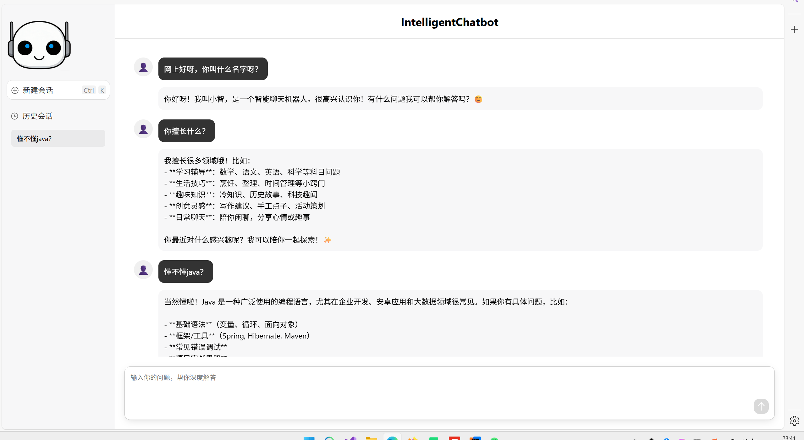

# 智能聊天机器人 

<div align="center">
  <a href="https://gitee.com/phoenix-cities/intelligent-chatbot/blob/master/LICENSE">
    
  </a>
  <a href="https://gitee.com/phoenix-cities/intelligent-chatbot/stargazers">
    
  </a>
  <a href="https://gitee.com/phoenix-cities/intelligent-chatbot/members">
    
  </a>
  <a href="https://spring.io/projects/spring-boot">
    
  </a>
  
</div>

> 一个智能聊天AI工具，支持问答、历史会话查看等多种功能。采用前后端分离架构，基于SpringBoot AI和Deepseek构建，提供流畅的解答体验的功能体系。

## 功能特性

### 核心功能
    支持了deepseek等多个接口，实现聊天解答的功能。

### 技术亮点
- **前后端分离**: Vue.js + Spring Boot全栈解决方案
- **大模型**: deepseek接入


## 项目预览

### 主界面


## 快速开始

### 环境要求
- **Java**: JDK 17+
- **Springboot**: 3.2.6
- **SpringbootAI**: 3.2.6


#### 3. 后端配置和启动
```bash

```

#### 5. 访问应用

## 技术架构

### 系统架构图


### 前端技术栈
- **框架**: HTML+CSS+JAVASCRIPT

### 后端技术栈
- **框架**: Spring Boot 3.2.x


## 贡献指南

我们欢迎所有形式的贡献！请阅读 [贡献指南](docs/CONTRIBUTING.md) 了解详细信息。

### 开发流程
1. Fork 项目
2. 创建特性分支 (`git checkout -b feature/amazing-feature`)
3. 提交更改 (`git commit -m 'Add some amazing feature'`)
4. 推送到分支 (`git push origin feature/amazing-feature`)
5. 创建 Pull Request

### 代码规范
- 遵循项目代码规范
- 编写单元测试
- 更新相关文档
- 通过所有CI检查

### 问题报告
使用Gitee Issues报告问题，请提供：
- 详细的问题描述
- 复现步骤
- 环境信息
- 相关日志

## 路线图


## 项目状态

<div align="center">
  <a href="https://gitee.com/phoenix-cities/intelligent-chatbot/actions">
    
  </a>
  <a href="https://gitee.com/phoenix-cities/intelligent-chatbot/commits/master">
    
  </a>
  <a href="https://gitee.com/phoenix-cities/intelligent-chatbot/issues">
    
  </a>
</div>

### 最新版本
<div align="center">
  <a href="https://gitee.com/phoenix-cities/intelligent-chatbot/releases">
    
  </a>
</div>

### 活跃贡献者
<div align="center">
  <a href="https://gitee.com/phoenix-cities/intelligent-chatbot/contributors">
    
  </a>
</div>

## 许可证

本项目采用 [Apache-2.0](LICENSE) - 查看LICENSE文件了解详情

## 致谢

感谢以下开源项目和贡献者：
- [deepseek](https://www.deepseek.com/) - deepseek AI开放平台
- [Spring Boot](https://spring.io/projects/spring-boot) - Java应用框架


## 联系我们

- **项目主页**: https://gitee.com/phoenix-cities/intelligent-chatbot
- **问题反馈**: https://gitee.com/phoenix-cities/intelligent-chatbot/issues
- **讨论区**: https://gitee.com/phoenix-cities/intelligent-chatbot/issues/new
- **邮箱**: support@come-xiaqi.com

---

<div align="center">
  <p>如果这个项目对你有帮助，请给我们一个 Star</p>
  <p>Made with love by intelligent-chatbot Team</p>
</div>